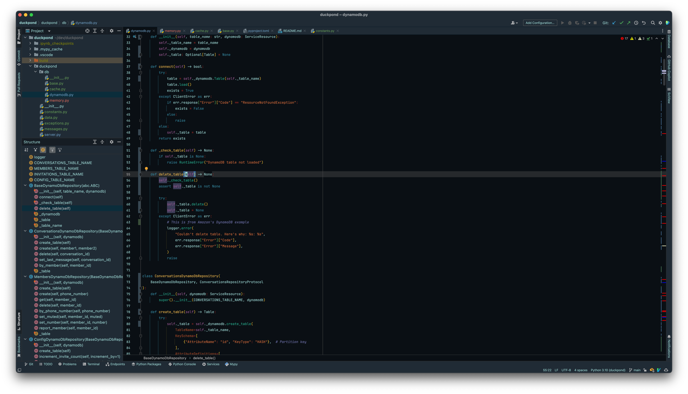

# Gotham Theme

</img>

<!-- Plugin description -->

> It's the colorscheme we set that defines us. (Batman)

A very dark color scheme for IntelliJ Platform IDEs based on the popular
[Visual Studio Code version](https://marketplace.visualstudio.com/items?itemName=alireza94.theme-gotham).

<!-- Plugin description end -->